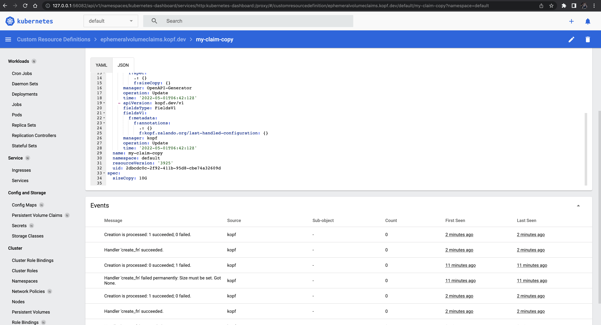
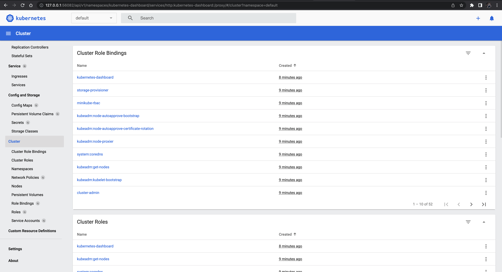

# README

## Demo


## Concepts
- k8s: https://kubernetes.io/docs/tutorials/kubernetes-basics/explore/explore-intro/
- bare-metal server -> docker prevision -> compute node(s) -> cluster
- cluster(us-east-1a) -> namespace
- 

## Install
- Python >= 3.7 
- Install `kubectl`
    - https://kubernetes.io/docs/tasks/tools/install-kubectl-macos/
    - 
    ```bash
       curl -LO "https://dl.k8s.io/release/$(curl -L -s https://dl.k8s.io/release/stable.txt)/bin/darwin/amd64/kubectl"
    ```
- Install `minikube` (a local Kubernetes cluster)
    - https://minikube.sigs.k8s.io/docs/start/
    - commands:
    ```bash
    curl -LO https://storage.googleapis.com/minikube/releases/latest/minikube-darwin-amd64
    sudo install minikube-darwin-amd64 /usr/local/bin/minikube
    minikube start # start minikube
    minikube dashboard # start dashboard
    ```
    
- Install `kopf`
    - https://kopf.readthedocs.io/en/stable/install/
    - commands:
    ```bash
    pip install kopf
    ```
- Install `kubernetes`
    - https://github.com/kubernetes-client/python/blob/master/kubernetes/docs/CustomObjectsApi.md
    - `pip install kubernetes`

## Create CRD
- create a CRD definition `crd.yaml`
- run `kubectl apply -f crd.yaml` to apply the CRD definition to the cluster
    - Note: to delete the CRD definition to the cluster
    ```bash
    kubectl delete crd ephemeralvolumeclaims.kopf.dev
    kubectl delete -f crd.yaml
    ```
- create a sample object `obj.yaml`
- run `kubectl apply -f obj.yaml` to create the sample object in the cluster


## Create CRD operator
- create a CRD operator `ephemeral.py`
- run `kopf run ephemeral.py --verbose` to aookt